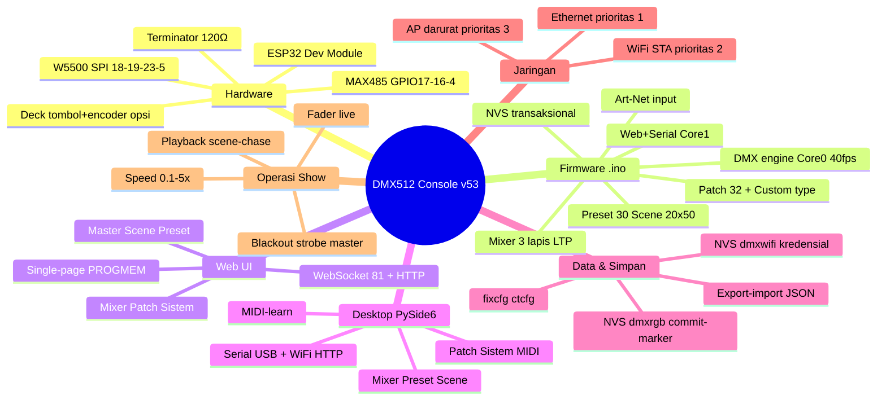
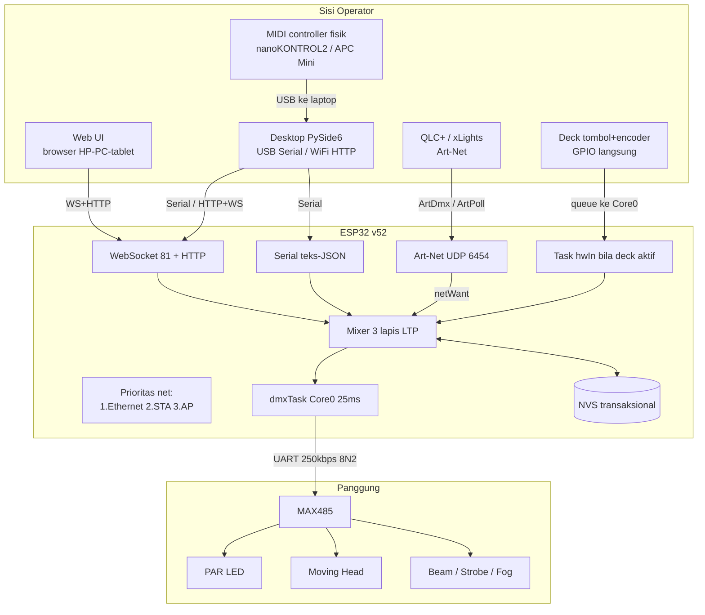
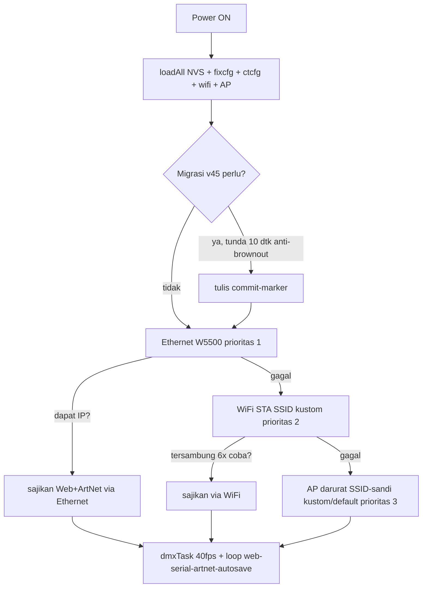
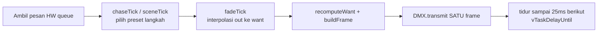
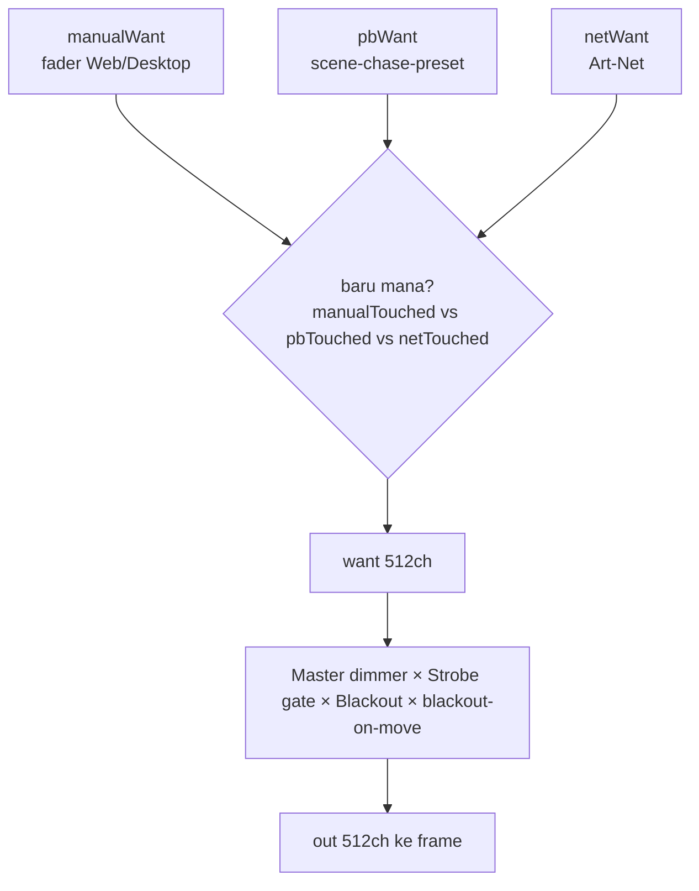
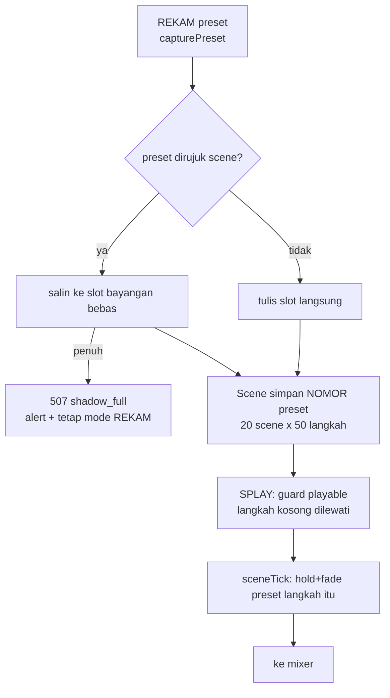
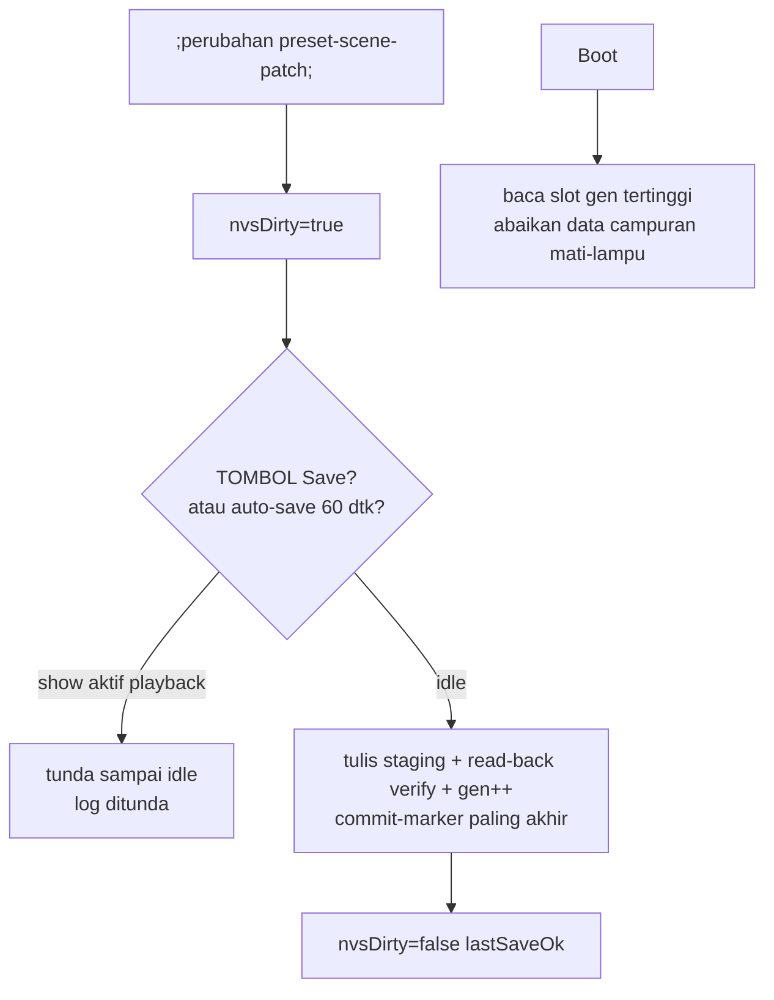
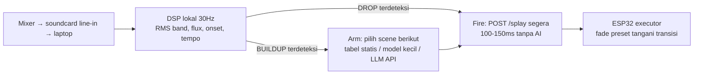

# Peta Sistem — DMX512 ESP32 Web Lighting Console

> Sumber fakta: `dmx_web_rgb/dmx_web_rgb.ino` (BUILD_TAG **v52**), `desktop/`, `docs/logs.md` (Session 71), `README.md`, `docs/wiring_diagram.txt`, `ses/` (8 file: feda, fc32, fbed, fbe6, fbbe, fbb9, fa3d, f8d8).
> Cara baca: Bagian 1 = peta pikiran (gambaran 1 halaman), Bagian 2 = flow (alur kerja), Bagian 3 = desain (detail tiap subsistem), Bagian 4 = riwayat versi v45→v52, Bagian 5 = rencana AI controller.

---

## 1. Peta Pikiran (Mind Map)



### 1.1 Peta pikiran per subsistem

**Hardware:**
- Komputasi: ESP32 Dev Module (diuji D0WD-V3 rev 3.1), Arduino-ESP32 core 3.x (diuji 3.3.7).
- Bus DMX: MAX485 → `GPIO17=DI`, `GPIO16=RO` (opsional, input saja), `GPIO4=DE+RE` (HIGH=TX). Catatan: `docs/wiring_diagram.txt` masih menulis GPIO21 — **yang benar di kode adalah GPIO4**.
- Ethernet: W5500 via SPI (`SCLK=18, MISO=19, MOSI=23, CS=5`), DHCP otomatis.
- Deck fisik (opsional): tombol scene `32/33/27/14`, encoder `CLK=25, DT=26, SW=13`, semua `INPUT_PULLUP` aktif-LOW. Riwayat: v50 dimatikan total (`HW_DECK_ENABLE 0`) karena terbukti penyebab lagging (A/B test); v50.1 memperbaiki akar masalahnya (**message-passing**: task tombol hanya kirim pesan, `dmxTask` Core 0 satu-satunya penulis playback) sehingga kode saat ini `#define HW_DECK_ENABLE 1` (baris 469). README masih menulis default-nonaktif v50 — **ikuti nilai di kode saat compile**.
- Bus: A(+)/B(−) twisted-pair, terminator 120Ω di ujung chain, GND bersama XLR pin 1.

**Firmware (satu file `dmx_web_rgb.ino`):**
- Core 0 = `dmxTask` perioda tetap 25 ms (~40 fps, `vTaskDelayUntil`).
- Core 1 = `setup/loop`: web server, WebSocket, serial, Art-Net (`artnetTask`), WiFi (`wifiReconnectTick`), auto-save NVS.
- Satu-satunya penulis state playback dari jalur HW adalah `dmxTask` (pesan hw dikirim via queue, dieksekusi di Core 0).

**Web UI / Desktop:** keduanya *client* — ESP32 adalah sumber state tunggal (`stateRevision` + `sceneRev`).

---

## 2. Flow (Alur Kerja)

### 2.1 Arsitektur total



### 2.2 Boot



Serial Monitor 115200 harus menampilkan `=== DMX Web Console v53 ===` + IP aktif.

> v53: STA bisa dilewati (`staEnable=0`), AP bisa dipaksa nyala (`apEnable=1`,
> `ensureApOn()`), radio bisa mati total (`WIFI_OFF`, hanya bila ETH up).
> Safety net boot: (STA off, AP off) tanpa ETH → AP darurat dipaksa (runtime).

### 2.3 Satu tick DMX engine (Core 0, tiap 25 ms — TIDAK bisa dipercepat)



Konsekuensi desain (v51.2/v51.3):
- Fader Speed 0.1–5x **hanya memendekkan durasi TAHAN langkah** (`nextAt = now + stepFloor(ms/speed)`), bukan laju kabel. Laju kabel terkunci 40 fps standar USITT/ESTA.
- `stepFloor(25ms)` + clamp `fade ≤ durasi langkah efektif` menghilangkan blink/tercampur + jitter 25↔50 ms.
- Tidak ada antrean frame: tick telat = satu stutter terukur `DMXSTAT`, tidak menumpuk.

### 2.4 Mixer 3 lapis (LTP per-timestamp)



- Semua timestamp `millis()` (wrap-safe).
- Master/strobe/speed = state operator *ephemeral* (tidak memicu `nvsDirty`, hemat flash).

### 2.5 Preset → Scene → Playback (dengan Copy-on-Write)



- Import web (`importJson`) & serial (`IMPORT_END`, dipakai desktop USB) sama-sama ber-COW; slot gagal dilewati + `warn shadow_full`, `sceneRev++`.
- `SCANCOW` (serial, read-only): `{refTotal, hidden, shadow, free, orphan}` — cek `free` sebelum show, `orphan>0` = indikasi bocor/data lama.
- Menghapus preset hanya flag `used=0`, data utuh agar scene lama tidak rusak.
- Langkah scene menampilkan *swatch warna* preset yang dirujuk.

### 2.6 Simpan / NVS transaksional



Namespace/key:
- `dmxrgb`: `sver2, pc0, pc1` (preset 30 dipecah 2 key karena batas 4000 byte/value), `sc` (scene), `selP, selS, gen`.
- `dmxwifi`: `ssid/pass` (STA) + `apssid/appass` (AP darurat v52) + `staen/apen` (saklar radio v53).
- `fixcfg` (patch 32 fixture), `ctcfg` (11 tipe custom slot 5–15).
- `speedMul`, `artnetMode` = ephemeral, tidak disimpan.

### 2.7 Sinkronisasi lintas-client

```mermaid
sequenceDiagram
    participant W as Web UI
    participant F as ESP32
    participant D as Desktop
    W->>F: WS {"t":"s"} / HTTP /set (fire-and-forget)
    F->>F: stateRevision++ (atomic)
    F-->>W: broadcast /cur + WS 10Hz + heartbeat 1s
    F-->>D: broadcast yang sama (GET/LIST + WS)
    D->>F: SPD / FIXSET / ARTNET (serial atau HTTP)
    F-->>W: revision baru → syncFromServer (anti-echo activeKey)
    Note over W,D: Klien tak pernah bicara langsung; selalu lewat ESP32
```

Aturan desktop (v43-latency): `request()` (tunggu balasan, untuk GET/LIST/EXPORT) vs `send()` (tanpa tunggu, untuk fader SET/MAST/STRB/GRP).

---

## 3. Desain (Detail Subsistem)

### 3.1 Hardware

| Blok | Desain | Catatan |
|---|---|---|
| MCU | ESP32 Dev Module, core 3.x | DMX presisi butuh `vTaskDelayUntil`, bukan `delay` |
| DMX out | MAX485, `DI=17`, `RO=16` (opsional), `DE+RE=4 HIGH=TX` | TX-only boleh RO tak disambung; modul 5V → RO via divider 1k+2k bila dipakai |
| Ethernet | W5500 SPI 18/19/23/CS 5, DHCP | Prioritas 1, staged delay anti-spike PSU |
| Deck | Tombol 32/33/27/14 + encoder 25/26/13, PULLUP internal | 5 lapis anti-noise EMI; trigger-split B2/B3 go-button; kill `HWOFF/HWON`; task prio 12; **v50.1: message-passing ke Core 0** (tak sentuh mutex/state langsung) |
| Diagnosis | Serial `DMXSTAT` + `SCANCOW` | `DMXSTAT`: min/avg/max frame + `tickMax` (>10 ms = contention mutex) + `stutter` (frame >50 ms) + `nvsFrz` (stutter saat tulis flash) + `hwTrig`; `SCANCOW`: `{refTotal, hidden, shadow, free, orphan}` |
| Daya | USB ≥900 mA atau PSU 5 V ≥2 A | Gejala kurang: `BOD Brownout` berulang |
| Bus | Twisted-pair 120Ω, terminator ujung, XLR A=pin3 B=pin2 GND=pin1 | Daisy-chain, 1 universe = 512 ch |

### 3.2 Firmware — modul dalam satu `.ino`

| Modul | Isi | Lokasi logis |
|---|---|---|
| State | `want/out`, `manualWant/pbWant/netWant` + touched, `master/strobeWant/speedMul`, `selectedPreset/Scene`, `stateRevision/sceneRev` (atomic) | atas file |
| Patch | `fix[32]`, `N_FIX` runtime, `MAX_FIX=32`, `FIX_DEFAULT` 18 fixture (10 PAR 9ch + MH/Beam/Strobe/Fog) | ~baris 149–216 |
| Preset/Scene | `presets[30][513]`, `scenes[20][50]`, fade/hold per preset, `blackoutEnd[32]` | ~baris 222–314 |
| Art-Net | `artnetUdp:6454`, `artnetMode`, seq-window, `artnetTask()` di `loop()` | ~baris 361–456 |
| HW deck | queue → `dmxTask`, common-mode detector, debounce 60 ms, lockout | ~baris 461–788 |
| NVS | `persistAll/loadAll`, commit-marker `gen`, `fixcfg/ctcfg` | ~baris 974–1240 |
| Engine | `fadeTick/chaseTick/sceneTick/applyPresetToWant/recomputeWant`, `dmxTask` | ~baris 1344–1475, 3770–3813 |
| JSON/API | `buildStateJson/fixJson/presetsJson/scnJson/grpJson`, `sendUi` streaming PROGMEM chunked | ~baris 1527–1685, 3428–3598 |
| HTTP/WS/Serial | `server.on(...)`, `wsHandleCtl`, `processSerialIn` 20+ perintah | tersebar |
| WiFi | STA kustom + `wifiReconnectTick` + AP kustom v52 + saklar STA/AP v53 (`/netmode`, `NETMODE`, NVS `staen/apen`) | ~baris 93–140, 1733+ |
| WebUI | HTML/CSS/JS tertanam (panel Master/Scene/Preset/Mixer/Patch/Sistem) | ~baris 2414–3369 |

### 3.3 Patch & tipe custom

- 32 slot runtime: `{name, type, start 1–512, foot 1–32, hasMove}`; validasi: tidak overlap, `start+foot−1 ≤ 512`, tipe valid, nama tak kosong; gagal NVS → rollback.
- Tipe bawaan: PAR(0), Moving 20ch(1), Beam 16ch(2), Strobe(3), Fog(4).
- Tipe custom 11 slot (5–15): nama tipe + label per channel + mode per channel **Fader (0–255)** vs **Switch (snap 0/255 dua lapis client+firmware)** untuk relay/beban on-off.
- Mixer UI: dual-pane per tipe — kiri fader per-fixture, kanan **fader bank** (1 pesan agregat per frame); mobile: bank di atas, tabel patch jadi kartu.

### 3.4 API & protokol (ringkas, paritas 3 jalur)

| Fungsi | HTTP | Serial | WS |
|---|---|---|---|
| Realtime | `/set /grp /ctrl /chase` | `SET GRP MAST STRB ALL PSL` | `{"t":"s"/"mast"/"strb"/"all"/"b"/"spd"}` |
| Preset | `/psave /pload /psetfade /pclear /presets` | `PSL PSV PREC PDEL PSF PFH` | via state |
| Scene | `/spush /spop /sclear /splay` | `SPUSH SPOP SCLR SPLAY SSTOP` | via state |
| Patch | `GET/POST /fixes` | `LISTF FIXSET` | via state |
| Grup | `/groups` | `LISTG GRP` | — |
| Custom | `GET/POST /ctypes` | `LISTCT CTSET` | — |
| Art-Net | `/artnet` | `ARTNET ARTSTAT` | — |
| Kesehatan | `/health /cur` | `DMXSTAT GET` | broadcast |
| WiFi/AP | `/wifistat /wifiset /apset /netmode` | `WIFISTAT WIFISSET APSET NETMODE` | `spd` ikut state |
| Data | `/save /loaddata /export /import` | `SAVE LOAD EXPORT IMPORT_*` | — |
| Deck | — (indikator UI) | `HWOFF HWON` | `hwBank/hwEnc/hwB` di state |
| Audit | — | `SCANCOW` | — |

State JSON (`/cur` + WS): `cur{512}, master, strb, spd, fade, chase, chaseOn, sceneOn, scenesp, scn, stp, selectedPreset/Scene, revision, sceneRev, nvsDirty, lastSaveOk, hw*, apSsid, build`.

### 3.5 Web UI

Single-page dari firmware (streaming PROGMEM chunked, `reserve()` tepat — pelajaran bug `__SCNDATA__`).
Panel: **Master** (fader/strobe/blackout/chase/Speed/Art-Net) → **Scene** (20 × 50 + swatch) → **Preset** (30 pad + fade/hold) → **Mixer** (per-fixture + bank) → **Patch** (edit/tambah/hapus/reset + editor tipe custom) → **Sistem** (WiFi STA + AP darurat + switch radio STA/AP + Save/Load + status).
Mekanisme: WebSocket realtime + HTTP fallback, antrean `api()`, `syncFromServer` + anti-echo, banner `window.onerror` + `unhandledrejection`, `Cache-Control: no-store`, hard-refresh (Ctrl+F5) tiap flash baru.

### 3.6 Desktop

`desktop/`: `main.py` (MainWindow 1180×720, toolbar Via USB-Serial/WiFi-IP + SAMBUNG) → tab `mixer/presets/scenes/patch/system/midi` (`ui/`) + `state.py` (cermin `DeviceState`: fixtures/groups/presets/scenes/live/custom_types) + `transport.py` (`SerialTransport`/`HttpTransport` interface identik, keep-alive, `request` vs `send`) + `worker.py` (QThread serial, routing `data_received` vs `command_done`, `SPD` fire-and-forget) + `midi_handler.py` (`MidiMapper` + learn, `mido`/`rtmidi`). Mixer ada fader Speed (anti-echo `spd`); Sistem ada checkbox radio STA/AP (`NETMODE`).
Proteksi: tiap tab `apply_state` ber-try/except (satu tab error tak melumpuhkan UI), normalisasi scene ke list-of-int, fader grup hanya ikut bila semua member seragam (anti bug visual), `_pad_handler(lambda *a)` (arity PySide6).
Distribusi: `build.bat` + `DMX512Controller.spec` → **PyInstaller onedir** (`upx=False`), bagikan seluruh folder `dist/DMX512Controller/`. Syarat: Python 3.9–3.12, `PySide6==6.6.3.1` (jangan 6.7+ di Python 3.9 — bug `PyCMethod_New`), `pyserial/mido/python-rtmidi`.

### 3.7 Art-Net input

Node Art-Net 4: `ArtDmx` UDP 6454 (parser header/opcode/ProtVer/seq-window, drop duplikat/out-of-order, universe 0:0, 2–512 ch, buffer stack nol-heap) + `ArtPoll → ArtPollReply` (terdeteksi QLC+/xLights). Mode LOCAL/NETWORK via tombol/`/artnet`/`ARTNET` (ephemeral). Lapis ketiga mixer (`netWant`) adu LTP mulus dengan fader lokal.

### 3.8 Keamanan & batasan (jujur untuk dokumentasi)

- HTTP/WS **tanpa autentikasi**, sebagian mutasi masih GET demi kompatibilitas; Art-Net tanpa auth by design → **hanya closed-network** (SSID/switch sendiri). Auth + POST ada di roadmap.
- JSON besar masih `String` (streaming baru untuk UI); NVS value ≤4000 byte (alasan preset dipecah `pc0/pc1`); state lintas-core belum sepenuhnya atomik.
- Preset menyimpan channel absolut → setelah patch pindah address, **rekam ulang preset**.
- Roadmap: streaming export/import, pecah `.ino` jadi modul, NVS 48 KB + `PATCH_CH_TOTAL` 512, sACN in, Art-Net out (gateway), tap-sync BPM + XY-pad, multi-universe modular, auth, sound-active, port ESP32-S3.

### 3.9 Peta dokumen existing

| Dokumen | Isi |
|---|---|
| `README.md` | Gerbang utama: fitur, setup firmware+desktop, API ringkas, roadmap |
| `docs/SYSTEM_MAP.md` | **File ini**: peta pikiran + flow + desain |
| `docs/DESAIN.md` | Arah visual UI (dark `#15171a`, aksen `#ffb400`, Bahasa Indonesia) |
| `docs/DMX512_Research.md` | Riset protokol DMX512 |
| `docs/ESP32_DMX_Analysis.md` | Analisis pro-kontra ESP32 + BOM |
| `docs/wiring_diagram.txt` | Wiring (catatan: DE+RE tertulis GPIO21, aktual GPIO4) |
| `docs/TESTING.md` | Prosedur uji firmware/Web/desktop/serial/WiFi/Ethernet/MIDI |
| `docs/logs.md` | Changelog per sesi (sumber kebenaran versi v43→v52) |
| `ses/` | Arsip mentah sesi percakapan (8 file: feda, fc32, fbed, fbe6, fbbe, fbb9, fa3d, f8d8) |
| `tests/test_labels.py` | Unit test label channel |

---

## 4. Riwayat versi (v45→v52 — dari `ses/` + `docs/logs.md`)

| Versi | Perubahan | Session |
|---|---|---|
| v45 | Patch fixture runtime + NVS `fixcfg` | fbe6 |
| v46 | **Copy-on-Write** proteksi scene + NVS **transaksional** commit-marker `gen` + hint `shadow_full` | fbbe |
| v47 | Audit lintas-komponen; dual-fader bank; upkeep WebUI/desktop | fbbe |
| v48 | Tipe fixture custom (11 slot) + mode Switch + streaming UI PROGMEM anti-fragmentasi | fbbe |
| v49–v49.5 | Art-Net input node + ArtPoll; deck tombol+encoder + 5 lapis anti-EMI; fade akurat (akumulator fraksi); mobile bank-first; restart-guard | fa3d, fbbe |
| v50 | Deck **OFF** (`HW_DECK_ENABLE 0`) — A/B test membuktikan task hw penyebab lagging | fa3d |
| v50.1 | **Message-passing** hw→`dmxTask`; instrumentasi `DMXSTAT` (tickMax/stutter/nvsFrz/hwTrig); **show-safe NVS** (tunda tulis flash saat playback); deck ON kembali (kode = 1) | fa3d |
| v51.1 | COW paritas web+serial, `SCANCOW`, guard `SPLAY`, swatch langkah scene | f8d8 |
| v51.2 | Fader Speed 0.1–5x (scene+chase) + fix blink fade>hold | f8d8 |
| v51.3 | Floor langkah 25 ms (fader jujur, anti-jitter) | f8d8 |
| v52 | AP darurat kustom NVS (`/apset`, `APSET`) | f8d8 |
| v53 | Saklar independen STA/AP (`/netmode`, `NETMODE`, NVS `staen/apen`, anti-lockout) + fix audit speed (clamp fade hanya auto-run; slider Speed desktop) + hardening audit (ACK fire-ops dimatikan, worker anti-mati, import aman, radio ikut state broadcast) | Session 72 |

Akar lagging deck yang ditemukan (fa3d, terbukti bisect `BISECT_A_noHW` normal):
1. `hwPlayScene` menulis state playback dari Core 1 tanpa mutex → race dengan `sceneTick` Core 0 (langkah skip/ulang, ritme kacau).
2. Priority inversion `dmxMutex`: pemegang di Core 1 di-preempt WiFi prio 23 → `dmxTask` prio 18 menunggu.
3. Tulis NVS (~11 KB) membekukan cache instruksi **kedua core** per sektor → stutter sporadis (ditutup show-safe NVS).

Target presisi ke depan (fa3d, planning): **±250 µs antar-frame** — pacing dikunci ke hardware UART (`flush()` + jadwal absolut `t += 25.000 µs` kompensasi drift), bukan tick FreeRTOS; jam visual (`millis` per frame) ikut dikoreksi agar beat tak bergeser kumulatif.

---

## 5. Rencana AI controller (Session 52, `ses/session-ses_fbb9.md` — desain saja, belum dikerjakan)

Prinsip: **yang memilih boleh AI, yang menarik pelatuk harus DSP lokal.** LLM (cloud maupun lokal) 100 ms–5 s — tak pernah di loop beat; deteksi drop/transisi = masalah DSP (<300 ms).



- Fase 1 (langsung pakai, tanpa sentuh firmware): DSP rule-based + tabel siklus scene + log fitur/aksi sebagai dataset; fire = `POST /splay`, `/grp`, `/ctrl` ≤20–30 cmd/s; preset/scene = kosakata aksi (bukan regresi 512 ch).
- Fase 2: koreksi operator = label *imitation learning* → klasifier fitur→scene (sklearn dulu, LSTM/1D-CNN bila perlu).
- Fase 3 (opsional): LLM API hanya untuk *arm* saat buildup (timeout 3 s → fallback lokal); API gagal tak pernah merusak show.
- Prasyarat firmware bila masuk venue publik: mutasi GET→POST + token auth + rate limit + dead-man switch bridge (putus >2 s → hold/blackout) + ramp pan/tilt (delta >120 dipecah).

---

## Lampiran: checklist dokumentasi show (copy-paste)

```text
Sebelum show:
[ ] SCANCOW via serial: free > 5, orphan = 0
[ ] DMXSTAT: avg ~25ms, max < 50ms, tickMax ≤ 10ms, stutter = 0, nvsFrz = 0
[ ] Save Data → nvsDirty=false, lastSaveOk=true
[ ] Fallback diuji: matikan router → AP darurat muncul dgn SSID/sandi benar
[ ] Speed kembali 1.0x, scene STOP, blackout siap
[ ] .exe = build terbaru (folder dist lengkap), browser hard-refresh Ctrl+F5
```
